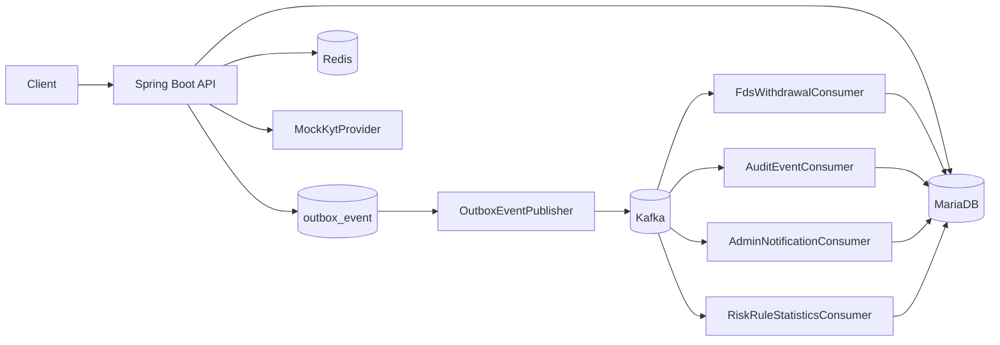
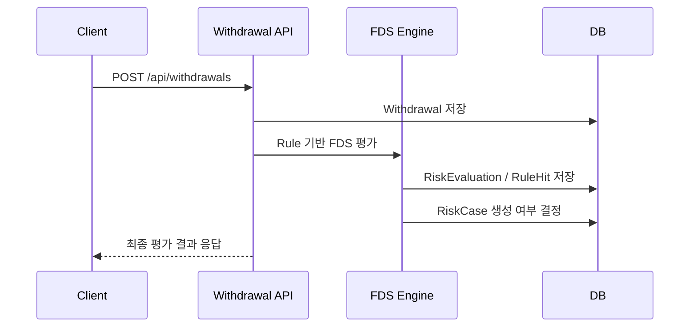
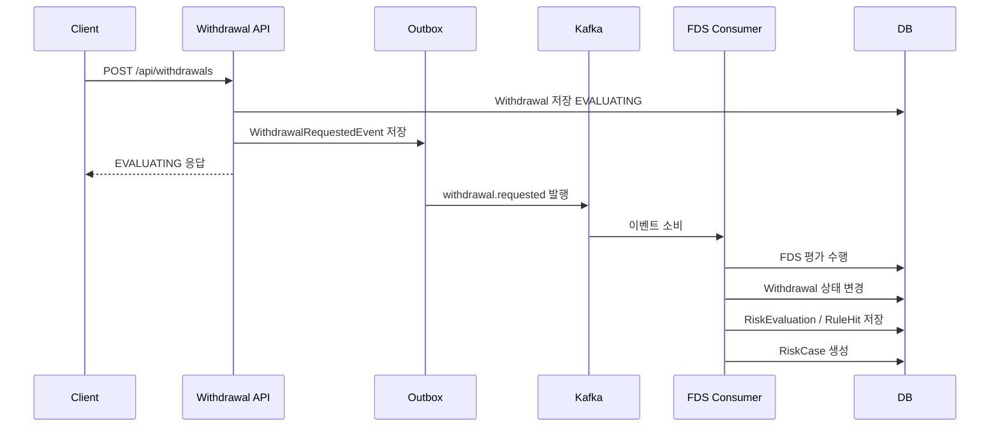

# Digital Asset Risk Platform

디지털 자산 출금 요청을 대상으로 Rule 기반 FDS 평가를 수행하고, 위험 출금은 `RiskCase`로 전환해 관리자 심사까지 연결하는 백엔드 리스크 관리 플랫폼입니다.

이 프로젝트는 단순한 출금 CRUD가 아니라 출금 요청, 위험 신호 수집, FDS 평가, 출금 상태 결정, Kafka 이벤트 발행, Outbox 기반 발행 안정성, Consumer 멱등성, 운영 API, Testcontainers 기반 검증까지 하나의 흐름으로 구성하는 데 초점을 두었습니다.

---

## 1. 문제 정의

디지털 자산 출금은 실제 자산 유출과 직접 연결되기 때문에 다음과 같은 위험 신호를 빠르게 탐지하고 추적할 수 있어야 합니다.

- 신규 기기 로그인 직후 출금
- OTP 재설정 직후 출금
- 비밀번호 변경 직후 출금
- 신규 지갑 주소 출금
- 고액 출금
- 24시간 내 반복 출금
- 고위험 지갑 주소 출금

탐지 결과는 단순 승인/거절로 끝나지 않고, 어떤 Rule이 어떤 근거로 적중했는지 `RiskEvaluation`과 `RiskRuleHit`에 남겨야 합니다. 또한 위험 출금은 `RiskCase`로 전환되어 관리자가 심사하고, Kafka 이벤트 발행 실패나 Consumer 중복 처리에도 데이터 정합성이 유지되어야 합니다.

---

## 2. 핵심 기능

### 출금 FDS

- 출금 요청 생성 및 상세 조회
- sync / async FDS 평가 모드 지원
- `RiskContext` 구성
- Rule 기반 위험 평가
- `DecisionEngine` 기반 출금 처리 결정
- `RiskEvaluation` / `RiskRuleHit` 저장
- 위험 출금 `RiskCase` 생성

### 관리자 심사

- `RiskCase` 목록/상세 조회
- 심사 시작, 승인, 거절, 오탐, 정탐 처리
- 사용자 리스크 타임라인 조회
- 관리자 알림 조회 및 읽음 처리
- Rule 설정 조회/수정
- Rule 변경 감사 이력 조회
- Rule 시뮬레이션
- Rule 적중 통계 조회

### Kafka / Outbox

- `withdrawal.requested` 이벤트 발행
- `risk.evaluation.completed` 이벤트 발행
- `risk.case.created` 이벤트 발행
- Outbox Pattern 기반 이벤트 발행 안정성 확보
- `FAILED` / `DEAD` 상태 조회 및 수동 재처리
- Consumer 멱등성 처리

### 운영 확장 요소

- Redis 기반 지갑 위험도 캐시
- KYT Provider Mock 기반 외부 지갑 위험도 조회 구조
- DB 기반 FDS Rule 설정
- 관리자 Rule 설정 조회/수정 및 변경 이력 관리
- Kafka / Redis Testcontainers 기반 E2E 테스트

---

## 3. 기술 스택

| Category | Stack |
| --- | --- |
| Language | Java 17 |
| Framework | Spring Boot |
| Web | Spring Web |
| Persistence | Spring Data JPA |
| Database | MariaDB |
| Messaging | Apache Kafka |
| Cache | Redis |
| Test | JUnit 5, AssertJ, Testcontainers, Awaitility |
| Monitoring | Spring Boot Actuator |
| Infra | Docker Compose |

---

## 4. 전체 아키텍처



초기에는 동기 FDS 평가로 비즈니스 정합성을 먼저 확보하고, 이후 Kafka 이벤트 발행, Consumer 후속 처리, Outbox Pattern, 비동기 FDS 평가 구조로 확장했습니다.

---

## 5. 출금 FDS 처리 흐름

### sync mode



### async mode



---

## 6. 관리자 API 목록

| Area | API | Purpose |
| --- | --- | --- |
| RiskCase | `GET /api/admin/risk-cases` | 위험 케이스 목록 조회 |
| RiskCase | `GET /api/admin/risk-cases/{caseId}` | 위험 케이스 상세 조회 |
| RiskCase | `POST /api/admin/risk-cases/{caseId}/start-review` | 심사 시작 |
| RiskCase | `POST /api/admin/risk-cases/{caseId}/approve` | 심사 승인 |
| RiskCase | `POST /api/admin/risk-cases/{caseId}/reject` | 심사 거절 |
| RiskCase | `POST /api/admin/risk-cases/{caseId}/mark-false-positive` | 오탐 처리 |
| RiskCase | `POST /api/admin/risk-cases/{caseId}/mark-true-positive` | 정탐 처리 |
| Rule Config | `GET /api/admin/risk-rules` | Rule 설정 목록 조회 |
| Rule Config | `GET /api/admin/risk-rules/{ruleCode}` | Rule 설정 상세 조회 |
| Rule Config | `PATCH /api/admin/risk-rules/{ruleCode}` | Rule 설정 수정 및 변경 이력 저장 |
| Rule Config | `GET /api/admin/risk-rules/{ruleCode}/histories` | Rule 설정 변경 이력 최신순 조회 |
| Rule Simulation | `POST /api/admin/risk-rules/simulate` | 운영 데이터 저장 없는 Rule 평가 시뮬레이션 |
| Rule Statistics | `GET /api/admin/risk-rule-statistics` | Rule 적중 통계 조회 |
| Rule Statistics | `GET /api/admin/risk-rule-statistics/top` | 상위 Rule 적중 통계 조회 |
| Outbox | `GET /api/admin/outbox-events/summary` | Outbox 상태 요약 조회 |
| Outbox | `GET /api/admin/outbox-events?status=FAILED` | Outbox 이벤트 목록 조회 |
| Outbox | `POST /api/admin/outbox-events/{eventId}/retry` | 실패 이벤트 수동 재처리 |
| Notification | `GET /api/admin/notifications` | 관리자 알림 조회 |
| Notification | `GET /api/admin/notifications/unread-count` | 읽지 않은 알림 수 조회 |
| Notification | `POST /api/admin/notifications/{notificationId}/read` | 알림 읽음 처리 |
| Dashboard | `GET /api/admin/risk-dashboard/summary` | 관리자 대시보드 요약 조회 |
| Timeline | `GET /api/admin/users/{userId}/risk-timeline` | 사용자 리스크 타임라인 조회 |

---

## 7. 2차 고도화

### Rule 변경 감사 이력

Rule 설정을 수정할 때 변경 전/후 값을 `RiskRuleConfigHistory`에 저장합니다. 이력에는 `changedBy`, `changeReason`, `changedAt`을 함께 남기며, Rule 수정과 이력 저장은 하나의 트랜잭션에서 처리합니다.

```text
PATCH /api/admin/risk-rules/{ruleCode}
  -> 기존 RiskRuleConfig 조회
  -> 변경 전 Snapshot 생성
  -> Rule 설정 변경
  -> 변경 후 Snapshot 생성
  -> RiskRuleConfigHistory 저장
```

운영자는 `GET /api/admin/risk-rules/{ruleCode}/histories`로 특정 Rule의 변경 이력을 최신 변경 시각순으로 확인할 수 있습니다.

### Rule 시뮬레이션 API

`POST /api/admin/risk-rules/simulate`는 운영 Rule 설정과 기존 `DecisionEngine`을 재사용해 입력한 출금 조건의 평가 결과만 반환합니다.

시뮬레이션은 실제 출금 요청이 아니므로 `WithdrawalRequest`, `RiskEvaluation`, `RiskRuleHit`, `RiskCase`를 저장하지 않습니다. Rule 점수, blocking 여부, 임계값 조정 전후의 영향을 운영 데이터 오염 없이 확인하기 위한 관리자용 API입니다.

---

## 8. 실행 방법

```bash
cp .env.example .env
docker compose -f docker-compose.yaml up -d
./gradlew bootRun
```

Windows PowerShell:

```powershell
Copy-Item .env.example .env
docker compose -f docker-compose.yaml up -d
.\gradlew bootRun
```

Health Check:

```bash
curl http://localhost:8080/actuator/health
```

Kafka UI:

```text
http://localhost:8085
```

---

## 9. 테스트 실행

전체 테스트:

```bash
./gradlew test
```

Kafka E2E 테스트:

```bash
./gradlew test --tests "*KafkaFullWithdrawalFdsE2ETest"
```

Redis 캐시 테스트:

```bash
./gradlew test --tests "*FdsWalletRiskCacheIntegrationTest"
```

Rule 변경 이력 Service 테스트:

```bash
./gradlew test --tests "*RiskRuleConfigAdminServiceTest"
```

Rule 시뮬레이션 Controller/Service 테스트:

```bash
./gradlew test --tests "*AdminRiskRuleSimulationControllerTest" --tests "*RiskRuleSimulationServiceTest"
```

Windows PowerShell:

```powershell
.\gradlew test
```

테스트는 Testcontainers 기반으로 Kafka, Redis, DB를 사용하므로 Docker Desktop 실행 환경이 필요합니다.

---

## 10. 문서

- [설계 문서](docs/architecture.md)
- [운영 문서](docs/operations.md)
- [테스트 전략](docs/test-strategy.md)
- [로컬 실행 가이드](docs/local-runtime.md)
- [API 문서](docs/api/index.md)
  - [출금 API](docs/api/withdrawals.md)
  - [관리자 RiskCase API](docs/api/risk-cases.md)
  - [운영 API](docs/api/admin-operations.md)
  - [Rule API](docs/api/risk-rules.md)
  - [보조 API](docs/api/support.md)

---

## 11. 향후 개선 방향

- 실제 KYT Provider 연동
- 관리자 권한/RBAC 적용
- Outbox DLQ 모니터링 고도화
- Prometheus/Grafana 기반 운영 지표 수집
- 실제 출금 실행 시스템 연동
