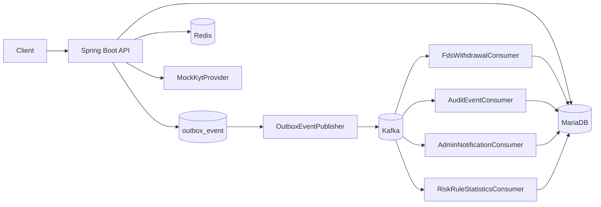
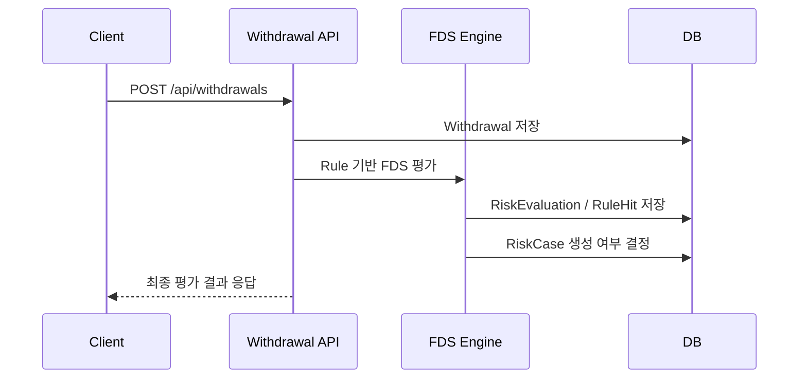
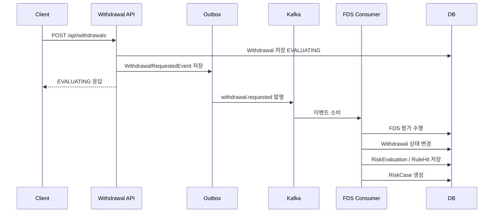

# Digital Asset Risk Platform

디지털 자산 출금 요청을 대상으로 Rule 기반 FDS 평가를 수행하고, 위험 출금은 `RiskCase`로 전환해 관리자 심사까지 연결하는 백엔드 리스크 관리 플랫폼입니다.

이 프로젝트는 단순한 출금 CRUD가 아니라 출금 요청, 위험 신호 수집, FDS 평가, 출금 상태 결정, Kafka 이벤트 발행, Outbox 기반 발행 안정성, Consumer 멱등성, 운영 API, Testcontainers 기반 검증까지 하나의 흐름으로 구성하는 데 초점을 두었습니다.

---

## 1. 문제 정의

디지털 자산 출금은 실제 자산 유출과 직접 연결되기 때문에 다음과 같은 위험 신호를 빠르게 탐지하고 추적할 수 있어야 합니다.

- 신규 기기 로그인 직후 출금
- OTP 재설정 직후 출금
- 비밀번호 변경 직후 출금
- 신규 지갑 주소 출금
- 고액 출금
- 24시간 내 반복 출금
- 고위험 지갑 주소 출금

탐지 결과는 단순 승인/거절로 끝나지 않고, 어떤 Rule이 어떤 근거로 적중했는지 `RiskEvaluation`과 `RiskRuleHit`에 남겨야 합니다. 또한 위험 출금은 `RiskCase`로 전환되어 관리자가 심사하고, Kafka 이벤트 발행 실패나 Consumer 중복 처리에도 데이터 정합성이 유지되어야 합니다.

---

## 2. 핵심 기능

### 출금 FDS

- 출금 요청 생성 및 상세 조회
- sync / async FDS 평가 모드 지원
- `RiskContext` 구성
- Rule 기반 위험 평가
- `DecisionEngine` 기반 출금 처리 결정
- `RiskEvaluation` / `RiskRuleHit` 저장
- 위험 출금 `RiskCase` 생성

### 관리자 심사

- `RiskCase` 목록/상세 조회
- 심사 시작, 승인, 거절, 오탐, 정탐 처리
- 사용자 리스크 타임라인 조회
- 관리자 알림 조회 및 읽음 처리
- Rule 적중 통계 조회

### Kafka / Outbox

- `withdrawal.requested` 이벤트 발행
- `risk.evaluation.completed` 이벤트 발행
- `risk.case.created` 이벤트 발행
- Outbox Pattern 기반 이벤트 발행 안정성 확보
- `FAILED` / `DEAD` 상태 조회 및 수동 재처리
- Consumer 멱등성 처리

### 운영 확장 요소

- Redis 기반 지갑 위험도 캐시
- KYT Provider Mock 기반 외부 지갑 위험도 조회 구조
- DB 기반 FDS Rule 설정
- 관리자 Rule 설정 조회/수정 API
- Kafka / Redis Testcontainers 기반 E2E 테스트

---

## 3. 기술 스택

| Category | Stack |
| --- | --- |
| Language | Java 17 |
| Framework | Spring Boot |
| Web | Spring Web |
| Persistence | Spring Data JPA |
| Database | MariaDB |
| Messaging | Apache Kafka |
| Cache | Redis |
| Test | JUnit 5, AssertJ, Testcontainers, Awaitility |
| Monitoring | Spring Boot Actuator |
| Infra | Docker Compose |

---

## 4. 전체 아키텍처



초기에는 동기 FDS 평가로 비즈니스 정합성을 먼저 확보하고, 이후 Kafka 이벤트 발행, Consumer 후속 처리, Outbox Pattern, 비동기 FDS 평가 구조로 확장했습니다.

---

## 5. 출금 FDS 처리 흐름

### sync mode



### async mode



---

## 6. 실행 방법

```bash
cp .env.example .env
docker compose -f docker-compose.yaml up -d
./gradlew bootRun
```

Windows PowerShell:

```powershell
Copy-Item .env.example .env
docker compose -f docker-compose.yaml up -d
.\gradlew bootRun
```

Health Check:

```bash
curl http://localhost:8080/actuator/health
```

Kafka UI:

```text
http://localhost:8085
```

---

## 7. 테스트 실행

전체 테스트:

```bash
./gradlew test
```

Kafka E2E 테스트:

```bash
./gradlew test --tests "*KafkaFullWithdrawalFdsE2ETest"
```

Redis 캐시 테스트:

```bash
./gradlew test --tests "*FdsWalletRiskCacheIntegrationTest"
```

---

## 8. 문서

- [설계 문서](docs/architecture.md)
- [운영 문서](docs/operations.md)
- [테스트 전략](docs/test-strategy.md)
- [로컬 실행 가이드](docs/local-runtime.md)
- [API 문서](docs/api/index.md)
  - [출금 API](docs/api/withdrawals.md)
  - [관리자 RiskCase API](docs/api/risk-cases.md)
  - [운영 API](docs/api/admin-operations.md)
  - [Rule API](docs/api/risk-rules.md)
  - [보조 API](docs/api/support.md)

---

## 9. 향후 개선 방향

- 실제 KYT Provider 연동
- Rule 설정 변경 이력 관리
- 관리자 권한/RBAC 적용
- Outbox DLQ 모니터링 고도화
- Prometheus/Grafana 기반 운영 지표 수집
- 실제 출금 실행 시스템 연동
