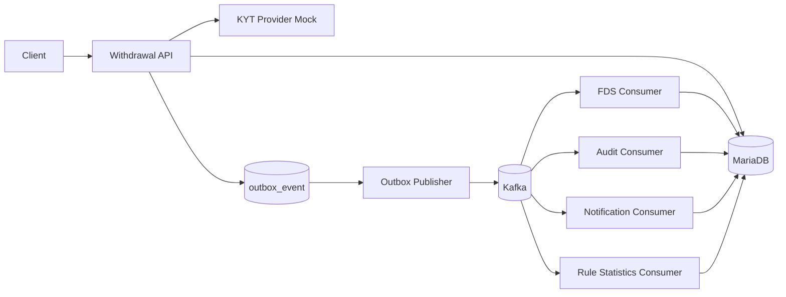
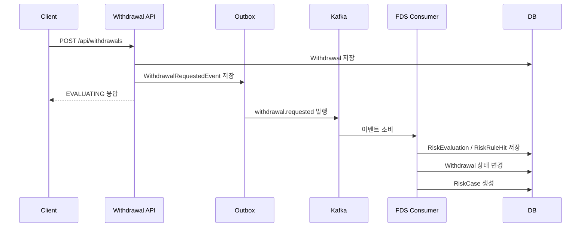

# Digital Asset Risk Platform

디지털 자산 출금 요청에 대해 Rule 기반 FDS 평가를 수행하고, 위험 출금은 관리자 심사 Case로 전환하는 리스크 관리 플랫폼입니다.

동기식 FDS 평가로 비즈니스 정합성을 검증하고, Kafka 이벤트 발행, Consumer 후속 처리, Outbox Pattern, 비동기 FDS 평가 구조로 확장할 수 있도록 설계했습니다.

## 1. 주요 기능

- 출금 요청 생성 및 상세 조회
- Rule 기반 FDS 평가
- RiskEvaluation / RiskRuleHit 저장
- 위험 출금 자동 보류 또는 차단
- RiskCase 생성 및 관리자 심사
- 오탐 / 정탐 처리
- KYT Provider Mock 기반 외부 지갑 위험도 조회 및 내부 WalletRisk 동기화
- Kafka 기반 이벤트 발행
- Outbox Pattern 기반 이벤트 발행 안정성 보장
- Kafka Consumer 기반 감사 로그, 관리자 알림, Rule 통계 처리
- sync / async 모드 기반 FDS 평가 전환

## 2. 기술 스택

- Java 17
- Spring Boot
- Spring Web
- Spring Data JPA
- MariaDB
- Kafka
- Redis
- Testcontainers
- JUnit 5 / AssertJ
- Spring Boot Actuator

## 3. 전체 아키텍처



## 4. 출금 FDS 흐름



## 5. Kafka & Outbox 요약

비즈니스 데이터 저장과 Kafka 발행은 하나의 트랜잭션으로 묶기 어렵기 때문에, 이벤트를 먼저 `outbox_event` 테이블에 저장하고 별도 Publisher가 Kafka로 발행합니다.

주요 Topic은 다음과 같습니다.

| Topic | Event |
| --- | --- |
| `withdrawal.requested` | `WithdrawalRequestedEvent` |
| `risk.evaluation.completed` | `RiskEvaluationCompletedEvent` |
| `risk.case.created` | `RiskCaseCreatedEvent` |

## 6. 실행 방법

```bash
docker compose -f docker-compose.yaml up -d
./gradlew bootRun
```

## 7. 테스트 실행

```bash
./gradlew test
```

## 8. 상세 문서

- [프로젝트 개요](docs/00-overview.md)
- [비즈니스 흐름](docs/01-business-flow.md)
- [API 명세](docs/02-api-spec.md)
- [FDS Rule 정책](docs/03-risk-rules.md)
- [상태 전이](docs/04-state-transition.md)
- [Kafka & Outbox 설계](docs/05-kafka-outbox.md)
- [멱등성 설계](docs/06-idempotency.md)
- [테스트 전략](docs/07-test-strategy.md)
- [KYT Provider Mock 테스트 가이드](docs/09-kyt-provider-mock-test-guide.md)
