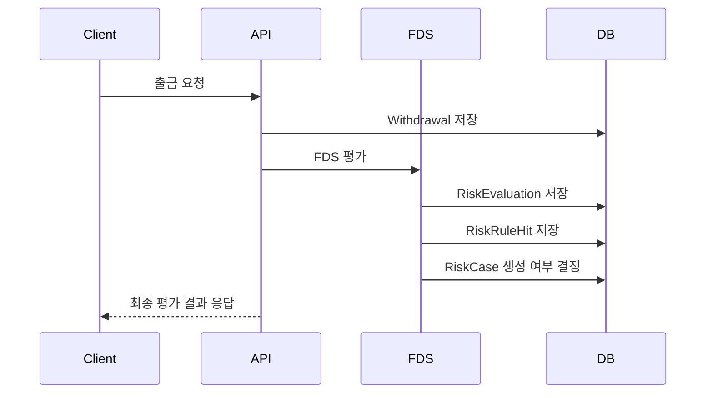
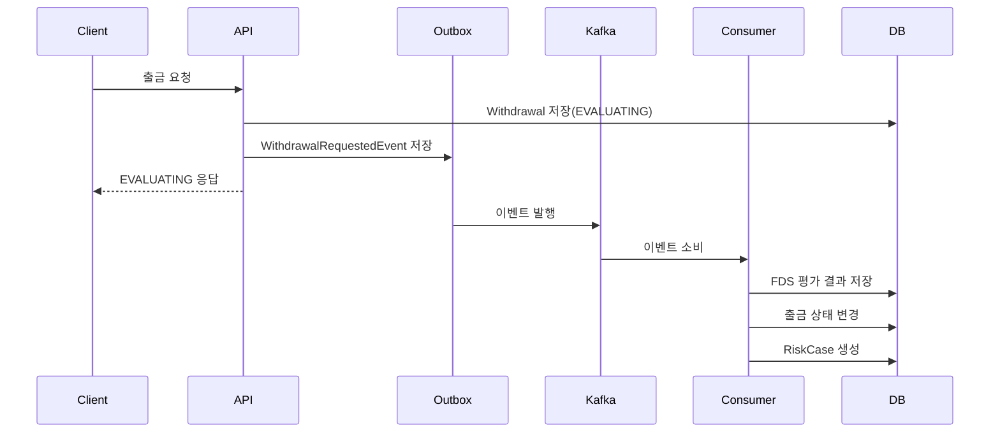
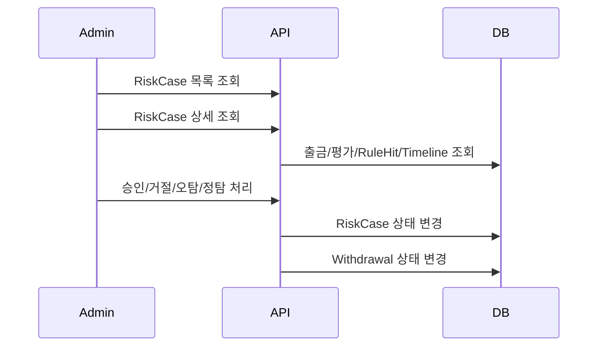

# 출금 FDS 비즈니스 흐름

## 1. 출금 요청 흐름

### sync 모드

### async 모드

## 2. 위험 판단 결과

| Decision | WithdrawalStatus | 설명 |
| --- | --- | --- |
| `ALLOW` | `APPROVED` | 정상 출금 |
| `MONITOR` | `APPROVED` | 모니터링 대상이나 출금 허용 |
| `REQUIRE_ADDITIONAL_AUTH` | `HELD` | 추가 인증 또는 관리자 확인 필요 |
| `HOLD_WITHDRAWAL` | `HELD` | 출금 보류 |
| `BLOCK_WITHDRAWAL` | `BLOCKED` | 자동 차단 |

## 3. 관리자 심사 흐름

## 4. 심사 액션

| API | 결과 |
| --- | --- |
| `POST /api/admin/risk-cases/{caseId}/start-review` | Case를 `IN_REVIEW`로 변경 |
| `POST /api/admin/risk-cases/{caseId}/approve` | Case 승인 및 출금 승인 |
| `POST /api/admin/risk-cases/{caseId}/reject` | Case 거절 및 출금 거절 |
| `POST /api/admin/risk-cases/{caseId}/mark-false-positive` | 오탐 처리 및 출금 승인 |
| `POST /api/admin/risk-cases/{caseId}/mark-true-positive` | 정탐 처리 및 출금 거절 |

