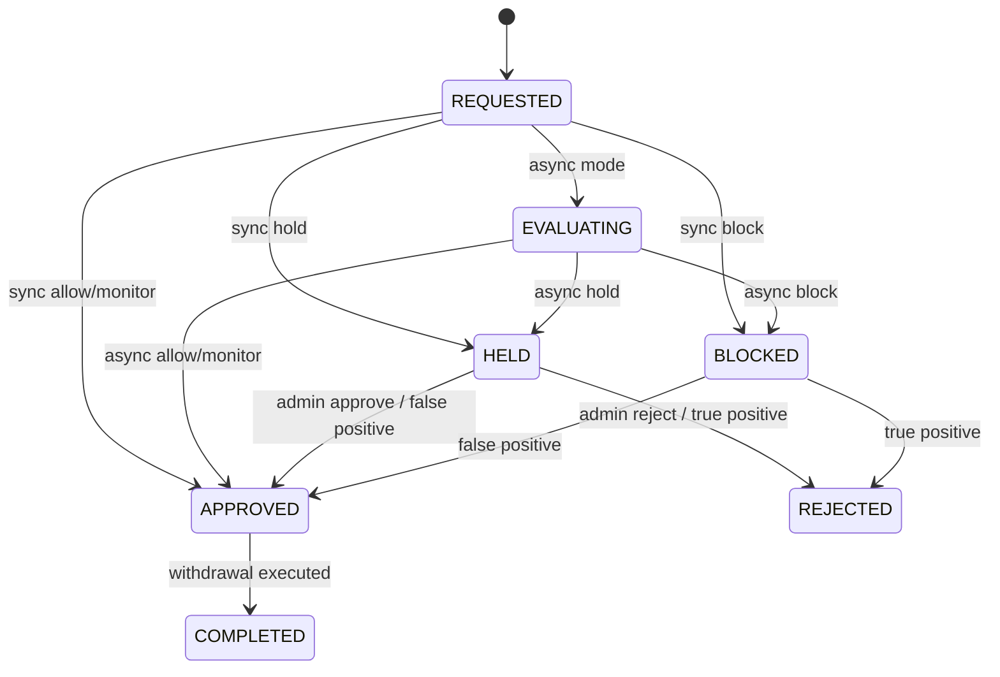
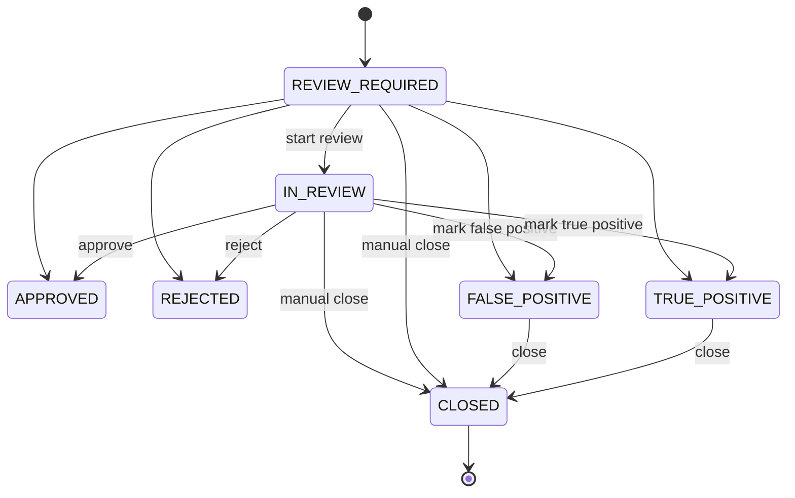

# 상태 전이 설계

## 1. WithdrawalStatus

## 상태 설명

| 상태 | 설명 |
| --- | --- |
| `REQUESTED` | 출금 요청 생성 |
| `EVALUATING` | FDS 비동기 평가 대기/진행 중 |
| `APPROVED` | 출금 승인 가능 |
| `HELD` | 관리자 심사 필요 |
| `BLOCKED` | 자동 차단 |
| `REJECTED` | 출금 거절 |
| `COMPLETED` | 실제 출금 완료 |

## 중요 정책

- `EVALUATING` 상태에서는 실제 출금 실행을 금지한다.
- `APPROVED` 상태가 되어야 실제 출금 실행 가능하다.
- `BLOCKED` 상태는 자동 차단 상태이며 관리자 심사 대상이다.
- `HELD` 상태는 관리자 판단 전까지 출금할 수 없다.

## 2. RiskCaseStatus

## 상태 설명

| 상태 | 설명 | 주요 전이 액션 |
| --- | --- | --- |
| `REVIEW_REQUIRED` | 심사 필요 | `start review`, `approve`, `reject`, `mark false positive`, `mark true positive`, `manual close` |
| `IN_REVIEW` | 심사 진행 중 | `approve`, `reject`, `mark false positive`, `mark true positive`, `manual close` |
| `APPROVED` | 정상 출금 승인 | 심사 완료 상태 |
| `REJECTED` | 출금 거절 | 심사 완료 상태 |
| `FALSE_POSITIVE` | 오탐 판정 | `close` 액션으로 `CLOSED` 전이 |
| `TRUE_POSITIVE` | 정탐 판정 | `close` 액션으로 `CLOSED` 전이 |
| `CLOSED` | 최종 종결 상태. 추가 심사나 상태 변경 없이 Case를 아카이브하는 상태 | 최종 상태 |

## CLOSED 정책

- `CLOSED`는 최종 종결 상태로 정의한다.
- `TRUE_POSITIVE`, `FALSE_POSITIVE` 판정 이후 `close` 액션으로 `CLOSED` 전이할 수 있다.
- `REVIEW_REQUIRED`, `IN_REVIEW` 상태에서도 관리자 판단에 따라 `manual close`로 수동 종결할 수 있다.
- 현재 `approve`, `reject`, `mark false positive`, `mark true positive` 액션은 심사 결과와 `closedAt`을 함께 기록하는 완료성 액션이다.
