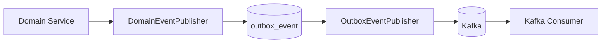

# Kafka & Outbox 설계

## 1. 이벤트 목록

| Topic | Event | 설명 |
| --- | --- | --- |
| `withdrawal.requested` | `WithdrawalRequestedEvent` | 출금 요청 생성 |
| `risk.evaluation.completed` | `RiskEvaluationCompletedEvent` | FDS 평가 완료 |
| `risk.case.created` | `RiskCaseCreatedEvent` | RiskCase 생성 |

## 2. 이벤트 발행 구조



## 3. Outbox Pattern 적용 이유

DB 저장과 Kafka 발행은 서로 다른 시스템에 대한 작업이기 때문에 하나의 트랜잭션으로 묶기 어렵습니다.

다음 문제가 발생할 수 있습니다.

```text
DB 커밋 성공
Kafka 발행 실패
이벤트 누락
```

이를 방지하기 위해 비즈니스 데이터 저장과 이벤트 저장을 같은 DB 트랜잭션으로 처리합니다.

```text
Withdrawal 저장
RiskEvaluation 저장
RiskCase 저장
OutboxEvent 저장
트랜잭션 커밋
```

그 후 별도 Publisher가 OutboxEvent를 읽어 Kafka로 발행합니다.

## 4. outbox_event 상태

| 상태 | 설명 |
| --- | --- |
| `PENDING` | 발행 대기 |
| `PROCESSING` | 발행 중 |
| `SENT` | 발행 성공 |
| `FAILED` | 발행 실패, 재시도 대상 |

## 5. 발행 재시도 정책

- Outbox Publisher는 `PENDING`, `FAILED` 상태 이벤트를 조회한다.
- `retryCount < 5`인 이벤트만 재시도한다.
- 발행 성공 시 `SENT`로 변경한다.
- 발행 실패 시 `FAILED`로 변경하고 `retryCount`를 증가시킨다.
- 기본 스케줄 주기는 `outbox.publisher.fixed-delay-ms` 값이며 기본값은 3000ms이다.

## 6. Producer Payload 전략

Outbox 적용 후 Kafka 발행은 JSON String 기반으로 수행한다.

```text
내부 이벤트 DTO
  ↓
ObjectMapper
  ↓
outbox_event.payload_json
  ↓
KafkaTemplate<String, String>
  ↓
Kafka
```

이 방식은 Outbox 재발행, 다중 언어 Consumer, 이벤트 스키마 관리에 유리하다.

