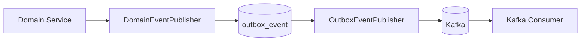
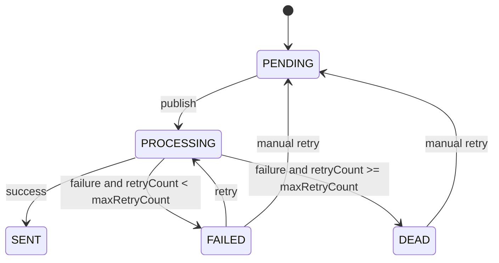

# Kafka & Outbox 설계

## 1. 이벤트 목록

| Topic | Event | 설명 |
| --- | --- | --- |
| `withdrawal.requested` | `WithdrawalRequestedEvent` | 출금 요청 생성 |
| `risk.evaluation.completed` | `RiskEvaluationCompletedEvent` | FDS 평가 완료 |
| `risk.case.created` | `RiskCaseCreatedEvent` | RiskCase 생성 |

## 1.1 Consumer 후속 처리

| Consumer | Topic | 주요 처리 |
| --- | --- | --- |
| `FdsWithdrawalConsumer` | `withdrawal.requested` | 비동기 FDS 평가 수행 |
| `AuditEventConsumer` | 전체 주요 Topic | 이벤트 감사 로그 저장 |
| `AdminNotificationConsumer` | `risk.case.created` | 관리자 알림 저장 |
| `RiskRuleStatisticsConsumer` | `risk.evaluation.completed` | Rule 적중 통계 증가 |

## 2. 이벤트 발행 구조



## 3. Outbox Pattern 적용 이유

DB 저장과 Kafka 발행은 서로 다른 시스템에 대한 작업이기 때문에 하나의 트랜잭션으로 묶기 어렵습니다.

다음 문제가 발생할 수 있습니다.

```text
DB 커밋 성공
Kafka 발행 실패
이벤트 누락
```

이를 방지하기 위해 비즈니스 데이터 저장과 이벤트 저장을 같은 DB 트랜잭션으로 처리합니다.

```text
Withdrawal 저장
RiskEvaluation 저장
RiskCase 저장
OutboxEvent 저장
트랜잭션 커밋
```

그 후 별도 Publisher가 OutboxEvent를 읽어 Kafka로 발행합니다.

## 4. outbox_event 상태

| 상태 | 설명 |
| --- | --- |
| `PENDING` | 발행 대기 |
| `PROCESSING` | 발행 중 |
| `SENT` | 발행 성공 |
| `FAILED` | 발행 실패, 재시도 대상 |
| `DEAD` | 최대 재시도 횟수에 도달하여 자동 발행이 중단된 상태 |

## 5. 발행 재시도 정책

- Outbox Publisher는 `PENDING`, `FAILED` 상태 이벤트를 조회한다.
- `retryCount < 5`인 이벤트만 재시도한다.
- 발행 성공 시 `SENT`로 변경한다.
- 발행 실패 시 `retryCount`를 증가시킨다.
- `retryCount`가 최대 재시도 횟수보다 작으면 `FAILED`로 변경한다.
- `retryCount`가 최대 재시도 횟수에 도달하면 `DEAD`로 변경한다.
- `DEAD` 이벤트는 자동 재시도 대상에서 제외한다.
- 기본 스케줄 주기는 `outbox.publisher.fixed-delay-ms` 값이며 기본값은 3000ms이다.

## 6. DEAD 상태 정책

Outbox 이벤트 발행이 반복 실패하여 `retryCount`가 최대 재시도 횟수에 도달하면 `DEAD` 상태로 전환한다.

`DEAD` 상태는 운영자 확인이 필요한 최종 실패 상태이다. Kafka 장애, 잘못된 payload, 잘못된 topic, 직렬화 문제 등 실패 원인을 확인한 뒤 수동 재처리 API로 `PENDING` 상태로 되돌릴 수 있다.



## 7. Outbox 운영 API

Outbox 운영 API는 발행 실패 이벤트를 조회하고, 운영자가 원인 확인 후 수동 재처리를 수행하기 위한 관리자 API입니다.

| API | 설명 |
| --- | --- |
| `GET /api/admin/outbox-events/summary` | 상태별 Outbox 이벤트 수 조회 |
| `GET /api/admin/outbox-events?status=FAILED&page=0&size=20` | 특정 상태의 Outbox 이벤트 목록 조회 |
| `GET /api/admin/outbox-events/{eventId}` | Outbox 이벤트 상세 조회 |
| `POST /api/admin/outbox-events/{eventId}/retry` | `FAILED` 또는 `DEAD` 이벤트를 `PENDING`으로 수동 전환 |

### 상태별 요약 조회

```http
GET /api/admin/outbox-events/summary
```

```json
{
  "pendingCount": 2,
  "processingCount": 0,
  "sentCount": 120,
  "failedCount": 1,
  "deadCount": 3
}
```

### 이벤트 목록 조회

목록 응답에는 `payloadJson`을 포함하지 않는다. 운영 화면에서는 payload가 긴 경우가 많기 때문에 상세 조회에서만 확인한다.

```http
GET /api/admin/outbox-events?status=DEAD&page=0&size=20
```

```json
{
  "content": [
    {
      "id": 10,
      "eventId": "event-001",
      "eventType": "RiskCaseCreatedEvent",
      "topicName": "risk.case.created",
      "messageKey": "100",
      "status": "DEAD",
      "retryCount": 5,
      "lastErrorMessage": "Kafka publish failed",
      "occurredAt": "2026-05-12T10:00:00",
      "createdAt": "2026-05-12T10:00:01",
      "updatedAt": "2026-05-12T10:05:00",
      "sentAt": null
    }
  ],
  "totalElements": 1,
  "totalPages": 1
}
```

### 이벤트 상세 조회

상세 응답에는 재발행 여부 판단에 필요한 `payloadJson`을 포함한다.

```http
GET /api/admin/outbox-events/event-001
```

```json
{
  "id": 10,
  "eventId": "event-001",
  "eventType": "RiskCaseCreatedEvent",
  "topicName": "risk.case.created",
  "messageKey": "100",
  "payloadJson": "{...}",
  "status": "DEAD",
  "retryCount": 5,
  "lastErrorMessage": "Kafka publish failed",
  "occurredAt": "2026-05-12T10:00:00",
  "createdAt": "2026-05-12T10:00:01",
  "updatedAt": "2026-05-12T10:05:00",
  "sentAt": null
}
```

### 수동 재처리

수동 재처리는 `FAILED`, `DEAD` 상태에서만 가능하다. 재처리 요청은 이벤트를 즉시 Kafka로 발행하지 않고 `PENDING`으로 되돌린다. 이후 Outbox Publisher 스케줄러가 다시 발행한다.

```http
POST /api/admin/outbox-events/event-001/retry
```

```json
{
  "id": 10,
  "eventId": "event-001",
  "eventType": "RiskCaseCreatedEvent",
  "topicName": "risk.case.created",
  "messageKey": "100",
  "payloadJson": "{...}",
  "status": "PENDING",
  "retryCount": 5,
  "lastErrorMessage": null,
  "occurredAt": "2026-05-12T10:00:00",
  "createdAt": "2026-05-12T10:00:01",
  "updatedAt": "2026-05-12T10:10:00",
  "sentAt": null
}
```

## 8. 운영 주의사항

- `DEAD` 이벤트는 자동 재시도 대상이 아니므로 운영자가 반드시 원인을 확인해야 한다.
- `payloadJson`이나 topic 자체가 잘못된 경우 수동 재처리만으로는 다시 실패할 수 있다.
- 수동 재처리 후에도 `retryCount`는 유지된다. 재발행 성공 여부는 이후 `SENT` 전환 여부로 확인한다.
- `SENT`, `PROCESSING`, `PENDING` 상태 이벤트는 수동 재처리 대상이 아니다.

## 9. Producer Payload 전략

Outbox 적용 후 Kafka 발행은 JSON String 기반으로 수행한다.

```text
내부 이벤트 DTO
  ↓
ObjectMapper
  ↓
outbox_event.payload_json
  ↓
KafkaTemplate<String, String>
  ↓
Kafka
```

이 방식은 Outbox 재발행, 다중 언어 Consumer, 이벤트 스키마 관리에 유리하다.
