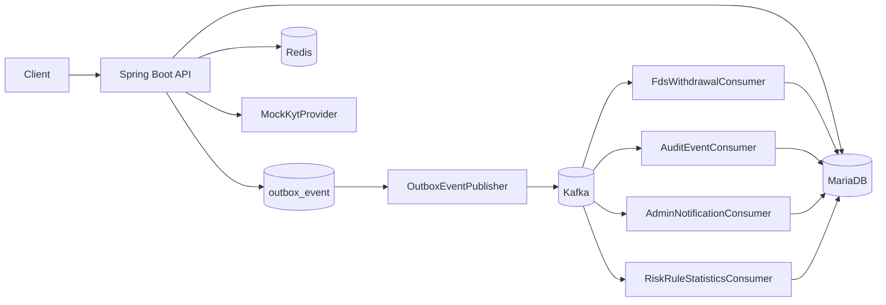
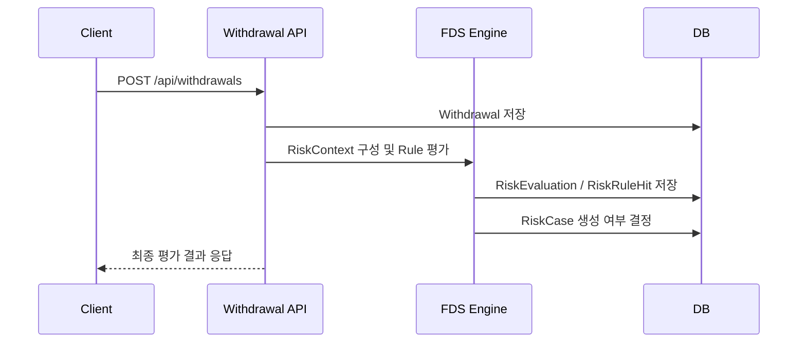
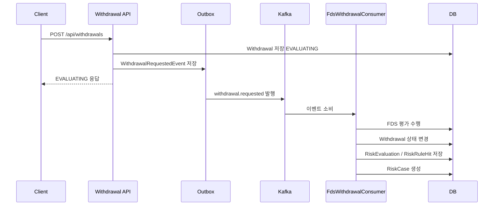
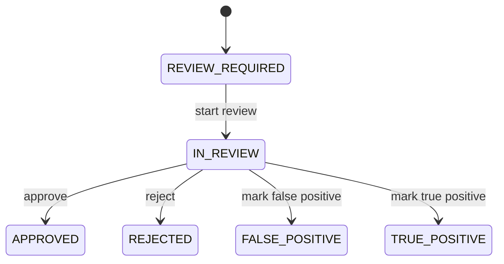
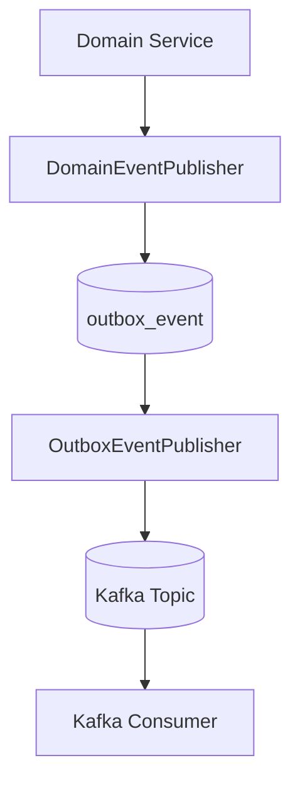
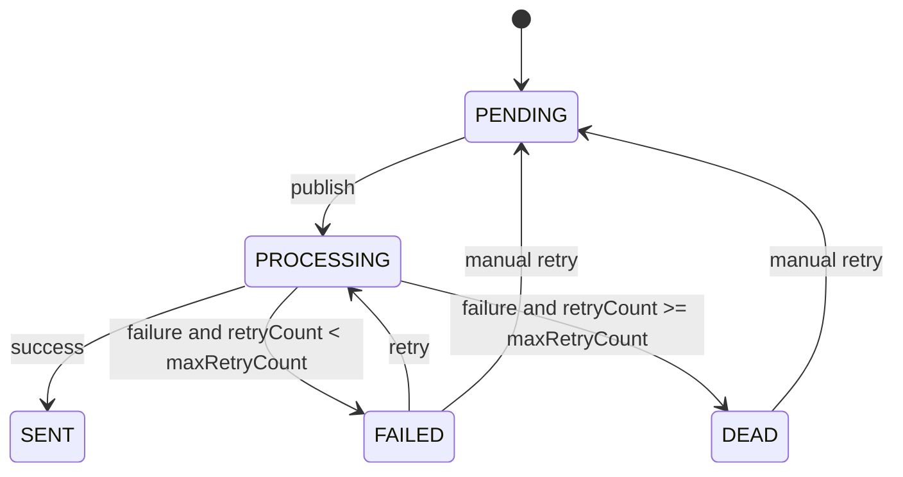

# Architecture

이 문서는 Digital Asset Risk Platform의 핵심 설계를 설명합니다. README가 전체 스토리라면, 이 문서는 출금 FDS가 어떤 구조로 동작하고 왜 Kafka, Outbox, Redis, KYT, Rule 설정 DB가 필요한지 설명하는 상세 설계 문서입니다.

---

## 1. 설계 목표

- 출금 요청 시점에 위험 신호를 평가한다.
- Rule 적중 근거를 `RiskEvaluation`과 `RiskRuleHit`으로 남긴다.
- 출금 상태를 FDS 평가 결과에 따라 일관되게 변경한다.
- 위험 출금은 `RiskCase`로 전환해 관리자 심사 흐름으로 연결한다.
- Kafka 이벤트 발행 실패와 Consumer 중복 처리에도 데이터 정합성을 유지한다.
- Rule 설정, 변경 이력, 운영 조회 기능을 통해 운영 가능한 FDS 구조로 확장한다.
- 운영 데이터 저장 없이 Rule 변경 영향을 확인할 수 있는 시뮬레이션 API를 제공한다.

---

## 2. 전체 구조



---

## 3. 출금 FDS 흐름

### sync mode

sync mode는 출금 요청 트랜잭션 안에서 FDS 평가를 수행하고 최종 결과를 바로 반환합니다. 비즈니스 정합성 검증과 단위/통합 테스트에 적합합니다.



### async mode

async mode는 출금 요청을 `EVALUATING` 상태로 저장한 뒤 `withdrawal.requested` 이벤트를 발행합니다. FDS 평가는 Kafka Consumer가 후속 처리합니다.



---

## 4. Rule 기반 탐지

FDS Rule은 `risk_rule_config` 테이블에서 관리합니다.

| Field | Description |
| --- | --- |
| `ruleCode` | Rule 식별자 |
| `enabled` | Rule 활성화 여부 |
| `score` | Rule 적중 점수 |
| `blocking` | 즉시 차단 여부 |
| `thresholdValue` | Rule별 임계값 |
| `description` | Rule 설명 |

Rule 설정을 수정하면 변경 전/후 값은 `risk_rule_config_history` 테이블에 저장됩니다.

| Field | Description |
| --- | --- |
| `ruleCode` | 변경 대상 Rule 식별자 |
| `before*` | 변경 전 enabled, score, blocking, threshold, description |
| `after*` | 변경 후 enabled, score, blocking, threshold, description |
| `changedBy` | 변경자 |
| `changeReason` | 변경 사유 |
| `changedAt` | 변경 시각 |

Rule 설정 변경과 이력 저장은 같은 트랜잭션 안에서 처리합니다. 대상 Rule이 없거나 변경 중 예외가 발생하면 이력도 저장하지 않습니다. 변경 이력 조회는 `changedAt` 기준 최신순으로 제공합니다.

주요 Rule은 다음과 같습니다.

| Rule Code | Description | Default Score | Blocking |
| --- | --- | ---: | --- |
| `NEW_DEVICE_WITHDRAWAL` | 신규 기기 로그인 직후 출금 | 30 | false |
| `OTP_RESET_WITHDRAWAL` | OTP 재설정 직후 출금 | 40 | false |
| `PASSWORD_CHANGED_WITHDRAWAL` | 비밀번호 변경 직후 출금 | 30 | false |
| `NEW_WALLET_ADDRESS` | 신규 지갑 주소 출금 | 20 | false |
| `HIGH_AMOUNT_WITHDRAWAL` | 고액 출금 | 40 | false |
| `FREQUENT_WITHDRAWAL_24H` | 24시간 내 반복 출금 | 30 | false |
| `HIGH_RISK_WALLET` | 고위험 지갑 주소 출금 | 100 | true |

---

## 5. Decision 정책

`DecisionEngine`은 Rule 적중 점수와 blocking Rule 여부를 기반으로 `RiskLevel`, `RiskDecisionType`, `WithdrawalStatus`를 결정합니다.

| Condition | RiskLevel | Decision | WithdrawalStatus |
| --- | --- | --- | --- |
| 낮은 점수 | `NORMAL` | `ALLOW` | `APPROVED` |
| 관찰 필요 | `WATCH` | `MONITOR` | `APPROVED` |
| 추가 확인 필요 | `CAUTION` | `REQUIRE_ADDITIONAL_AUTH` | `HELD` |
| 고위험 | `HIGH` | `HOLD_WITHDRAWAL` | `HELD` |
| blocking Rule 적중 | `CRITICAL` | `BLOCK_WITHDRAWAL` | `BLOCKED` |

blocking Rule이 적중하면 총점과 무관하게 `CRITICAL`로 판단합니다.

---

## 6. Rule 시뮬레이션

Rule 시뮬레이션은 관리자 입력으로 메모리상의 `WithdrawalRequest`를 만들고 기존 평가 구성 요소를 재사용합니다.

```text
RiskRuleSimulationRequest
  -> WithdrawalRequest 객체 생성
  -> RiskContextBuilder로 RiskContext 구성
  -> 현재 RiskRule 목록 평가
  -> DecisionEngine으로 totalScore / riskLevel / decision 계산
  -> RiskRuleSimulationResponse 반환
```

이 흐름은 실제 출금 요청이 아니므로 `WithdrawalRequest`, `RiskEvaluation`, `RiskRuleHit`, `RiskCase`를 저장하지 않습니다. 운영자는 Rule 점수, blocking 여부, 임계값 변경 전후의 영향을 운영 데이터 오염 없이 확인할 수 있습니다.

---

## 7. RiskCase 상태 흐름

위험 출금은 `RiskCase`로 전환되어 관리자 심사 대상이 됩니다.



관리자 심사 결과는 케이스 상태를 변경하고, 출금 상태와 운영 판단의 근거로 사용됩니다.

---

## 8. Kafka & Outbox

DB 저장과 Kafka 발행은 하나의 트랜잭션으로 묶기 어렵습니다. DB commit은 성공했지만 Kafka 발행이 실패하면 이벤트가 유실될 수 있습니다.

이를 방지하기 위해 도메인 데이터와 Outbox 이벤트를 같은 DB 트랜잭션에 저장하고, 별도 Publisher가 Outbox 이벤트를 Kafka로 발행합니다.



### 이벤트 목록

| Topic | Event | Consumer |
| --- | --- | --- |
| `withdrawal.requested` | `WithdrawalRequestedEvent` | `FdsWithdrawalConsumer`, `AuditEventConsumer` |
| `risk.evaluation.completed` | `RiskEvaluationCompletedEvent` | `AuditEventConsumer`, `RiskRuleStatisticsConsumer` |
| `risk.case.created` | `RiskCaseCreatedEvent` | `AuditEventConsumer`, `AdminNotificationConsumer` |

### Outbox 상태

| Status | Description |
| --- | --- |
| `PENDING` | 발행 대기 |
| `PROCESSING` | 발행 중 |
| `SENT` | 발행 성공 |
| `FAILED` | 발행 실패, 자동 재시도 대상 |
| `DEAD` | 최대 재시도 초과, 수동 확인 대상 |



---

## 9. Consumer 멱등성

Kafka Consumer는 같은 메시지를 중복 수신할 수 있습니다. 이 프로젝트는 처리한 `eventId`를 저장해 동일 이벤트가 다시 들어와도 중복 처리하지 않도록 구성합니다.

```text
Kafka message
  -> eventId 확인
  -> 이미 처리됨: skip
  -> 미처리: 비즈니스 로직 수행
  -> ConsumerProcessedEvent 저장
```

이 구조는 감사 로그, 관리자 알림, Rule 통계처럼 중복 처리 시 데이터가 누적될 수 있는 Consumer에서 특히 중요합니다.

---

## 10. Redis & KYT Provider Mock

`HIGH_RISK_WALLET` Rule은 출금 지갑 주소의 위험도를 조회합니다. 조회 흐름은 다음 순서로 진행됩니다.

```text
HighRiskWalletRule
  -> WalletRiskService
  -> Redis Cache
  -> DB fallback
  -> KYT Provider Mock fallback
```

KYT Provider Mock은 외부 KYT API 연동을 대체하는 테스트용 Provider입니다.

| Address Pattern | RiskLevel | RiskCategory |
| --- | --- | --- |
| `HACKED` | `HIGH` | `HACKED_FUNDS` |
| `SANCTION` | `CRITICAL` | `SANCTIONED_ADDRESS` |
| `MIXER` | `HIGH` | `MIXER` |
| `PHISH` | `HIGH` | `PHISHING` |
| 기타 | `LOW` | `NORMAL` |

위험 주소로 판정되면 `wallet_address_risk`에 저장되어 이후 FDS 평가에서 재사용됩니다.
