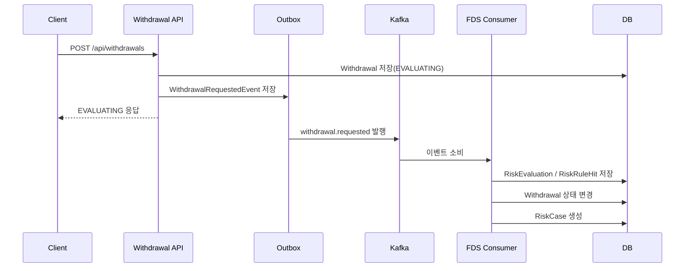

# Async Withdrawal FDS Sequence

```mermaid
sequenceDiagram
    participant Client
    participant API as Withdrawal API
    participant Outbox
    participant Kafka
    participant FDS as FDS Consumer
    participant DB

    Client->>API: POST /api/withdrawals
    API->>DB: Withdrawal 저장(EVALUATING)
    API->>Outbox: WithdrawalRequestedEvent 저장
    API-->>Client: EVALUATING 응답
    Outbox->>Kafka: withdrawal.requested 발행
    Kafka->>FDS: 이벤트 소비
    FDS->>DB: RiskEvaluation / RiskRuleHit 저장
    FDS->>DB: Withdrawal 상태 변경
    FDS->>DB: RiskCase 생성
```

