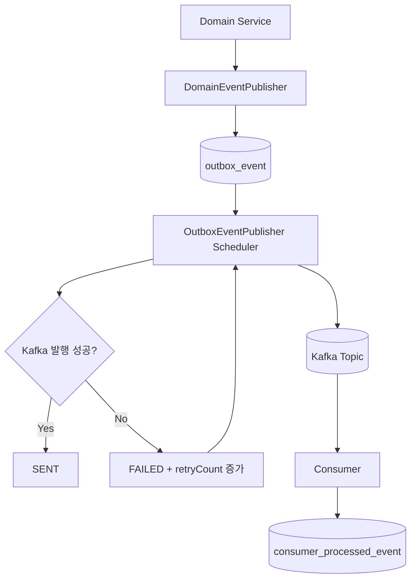

# Outbox Kafka Flow

```mermaid
flowchart TD
    A[Domain Service] --> B[DomainEventPublisher]
    B --> C[(outbox_event)]
    C --> D[OutboxEventPublisher Scheduler]
    D --> E{Kafka 발행 성공?}
    E -->|Yes| F[SENT]
    E -->|No| G[FAILED + retryCount 증가]
    G --> D
    D --> H[(Kafka Topic)]
    H --> I[Consumer]
    I --> J[(consumer_processed_event)]
```

