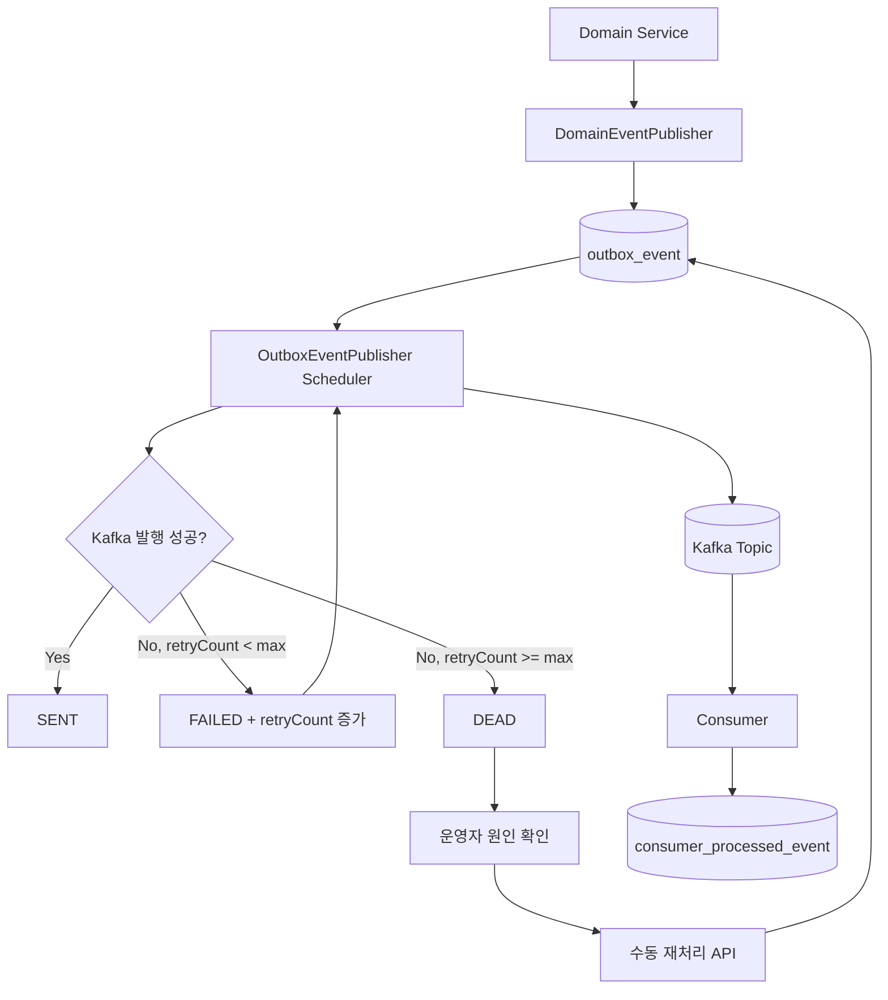

# Outbox Kafka Flow

```mermaid
flowchart TD
    A[Domain Service] --> B[DomainEventPublisher]
    B --> C[(outbox_event)]
    C --> D[OutboxEventPublisher Scheduler]
    D --> E{Kafka 발행 성공?}
    E -->|Yes| F[SENT]
    E -->|No, retryCount < max| G[FAILED + retryCount 증가]
    E -->|No, retryCount >= max| K[DEAD]
    G --> D
    K --> L[운영자 원인 확인]
    L --> M[수동 재처리 API]
    M --> C
    D --> H[(Kafka Topic)]
    H --> I[Consumer]
    I --> J[(consumer_processed_event)]
```
