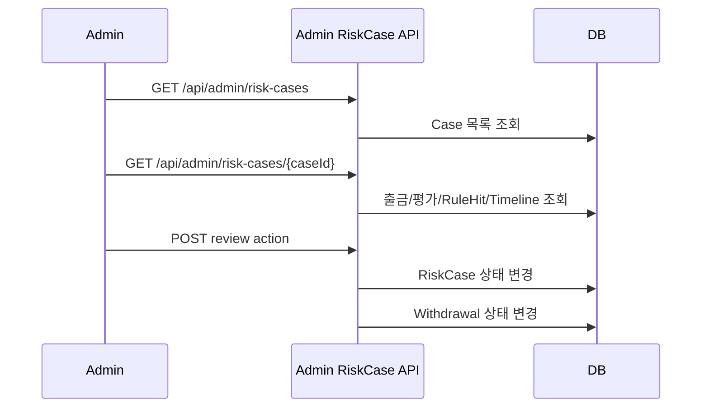

# Risk Case Review Sequence

```mermaid
sequenceDiagram
    participant Admin
    participant API as Admin RiskCase API
    participant DB

    Admin->>API: GET /api/admin/risk-cases
    API->>DB: Case 목록 조회
    Admin->>API: GET /api/admin/risk-cases/{caseId}
    API->>DB: 출금/평가/RuleHit/Timeline 조회
    Admin->>API: POST review action
    API->>DB: RiskCase 상태 변경
    API->>DB: Withdrawal 상태 변경
```

