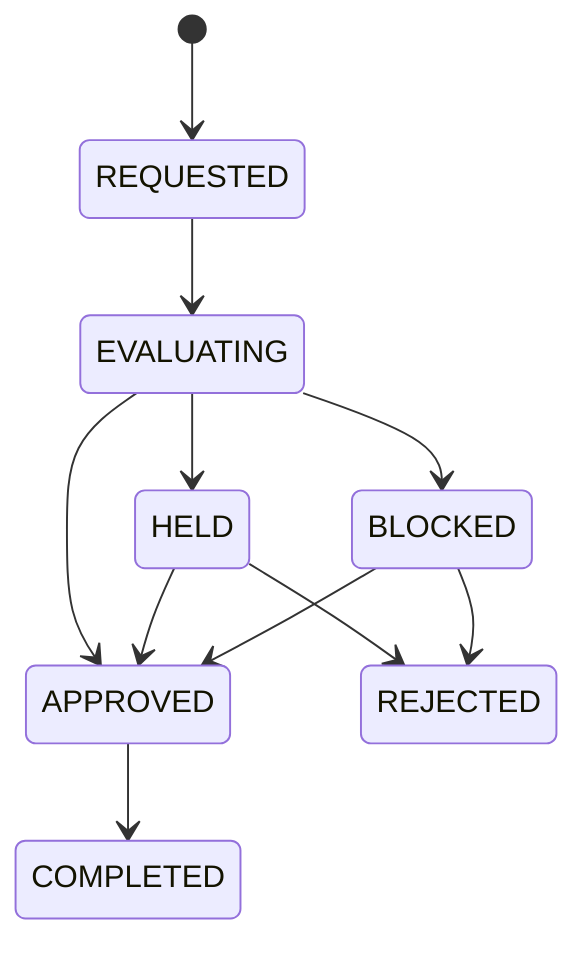
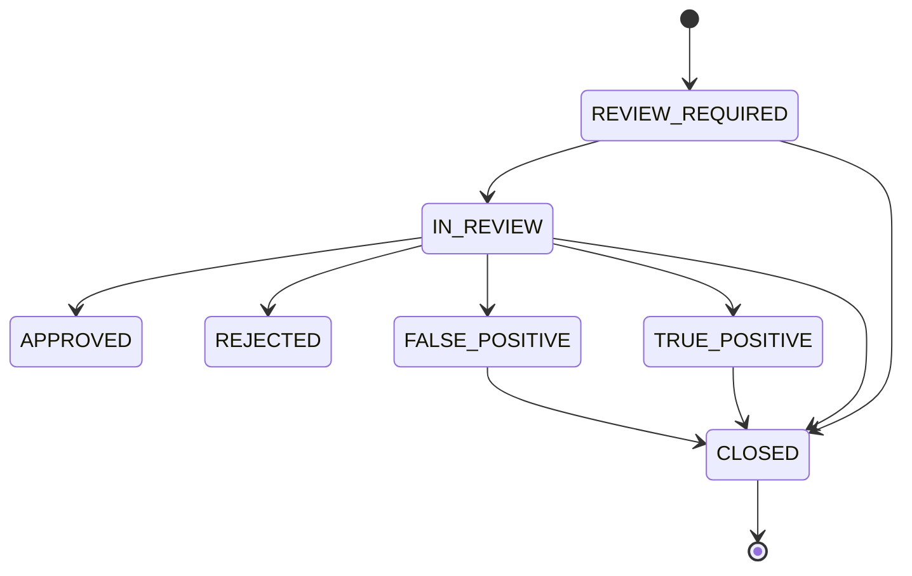

# State Transition

```mermaid
stateDiagram-v2
    [*] --> REQUESTED
    REQUESTED --> EVALUATING
    EVALUATING --> APPROVED
    EVALUATING --> HELD
    EVALUATING --> BLOCKED
    HELD --> APPROVED
    HELD --> REJECTED
    BLOCKED --> APPROVED
    BLOCKED --> REJECTED
    APPROVED --> COMPLETED
```

## Risk Case

```mermaid
stateDiagram-v2
    [*] --> REVIEW_REQUIRED
    REVIEW_REQUIRED --> IN_REVIEW
    IN_REVIEW --> APPROVED
    IN_REVIEW --> REJECTED
    IN_REVIEW --> FALSE_POSITIVE
    IN_REVIEW --> TRUE_POSITIVE
    TRUE_POSITIVE --> CLOSED
    FALSE_POSITIVE --> CLOSED
    REVIEW_REQUIRED --> CLOSED
    IN_REVIEW --> CLOSED
    CLOSED --> [*]
```
