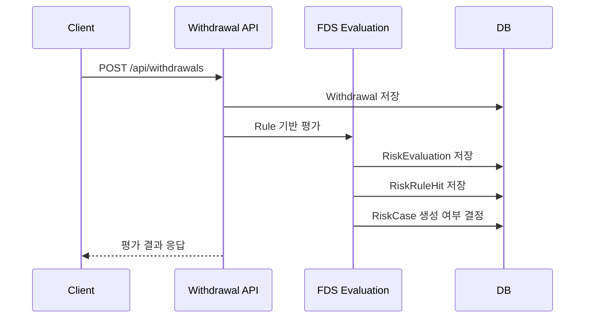

# Withdrawal FDS Sequence

```mermaid
sequenceDiagram
    participant Client
    participant API as Withdrawal API
    participant FDS as FDS Evaluation
    participant DB

    Client->>API: POST /api/withdrawals
    API->>DB: Withdrawal 저장
    API->>FDS: Rule 기반 평가
    FDS->>DB: RiskEvaluation 저장
    FDS->>DB: RiskRuleHit 저장
    FDS->>DB: RiskCase 생성 여부 결정
    API-->>Client: 평가 결과 응답
```

