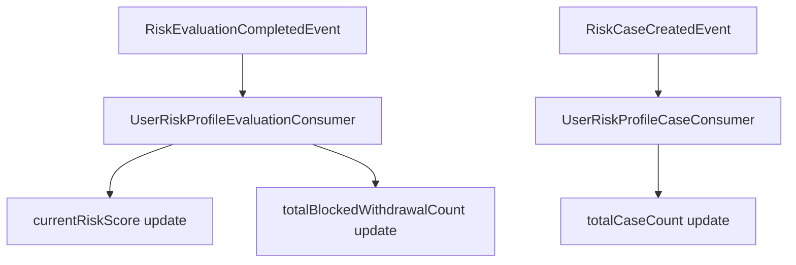

# User Risk Profile

이 문서는 단건 출금 FDS 평가 결과를 사용자 단위 누적 위험도로 확장하는 `UserRiskProfile` 기능을 설명합니다.

---

## 1. 배경

기존 FDS 흐름은 개별 출금 요청을 평가하고, 위험 출금이면 `RiskCase`를 생성하는 데 초점을 둡니다.

```text
WithdrawalRequest
  -> RiskEvaluation
  -> RiskCase 생성 여부 판단
```

`UserRiskProfile`은 이 단건 평가 결과를 사용자 단위로 누적해 장기적인 위험도를 표현합니다. 운영자는 특정 사용자의 현재 누적 위험 점수, 위험 등급, Case 발생 횟수, 차단 출금 횟수를 조회할 수 있습니다.

---

## 2. 설계 목표

- 단건 출금 위험 평가를 사용자 단위 누적 위험도로 확장한다.
- 평가 완료 이벤트와 Case 생성 이벤트의 책임을 분리한다.
- Kafka 중복 수신 시 누적 점수와 카운트가 중복 반영되지 않도록 한다.
- 동일 사용자 이벤트가 동시에 처리되어도 누적 값의 lost update 위험을 줄인다.
- 관리자 API로 사용자 위험 프로필을 조회할 수 있게 한다.

---

## 3. 이벤트 분리

`UserRiskProfile`은 두 이벤트를 서로 다른 의미로 사용합니다.

| Event | Profile update |
| --- | --- |
| `RiskEvaluationCompletedEvent` | `currentRiskScore` 갱신, `BLOCK_WITHDRAWAL`이면 `totalBlockedWithdrawalCount` 증가 |
| `RiskCaseCreatedEvent` | 실제 생성된 Case 수인 `totalCaseCount` 증가 |

`RiskEvaluationCompletedEvent`만으로 Case 수를 증가시키지 않는 이유는 실제 Case 생성 여부가 평가 완료 시점이 아니라 `RiskCaseService.createCaseIfNeeded()` 이후에 확정되기 때문입니다. 이 분리 덕분에 `totalCaseCount`는 "평가상 위험했던 횟수"가 아니라 "실제로 생성된 RiskCase 수"라는 의미를 유지합니다.



---

## 4. 점수 정책

단건 평가 점수를 그대로 사용자 누적 점수에 더하면 소수의 고위험 출금만으로 사용자 등급이 과도하게 상승할 수 있습니다. 그래서 `UserRiskProfilePolicy`가 단건 평가 점수를 사용자 프로필 점수로 변환합니다.

| Evaluation score | Profile score |
| ---: | ---: |
| `>= 100` | `+50` |
| `>= 70` | `+30` |
| `>= 30` | `+10` |
| `< 30` | `+0` |

누적된 `currentRiskScore`는 `UserRiskLevel`로 변환됩니다.

| Current risk score | User risk level |
| ---: | --- |
| `>= 150` | `CRITICAL` |
| `>= 80` | `HIGH` |
| `>= 30` | `WATCH` |
| `< 30` | `NORMAL` |

---

## 5. 데이터 모델

`user_risk_profile`은 사용자별 누적 위험 상태를 저장합니다.

| Column | Description |
| --- | --- |
| `user_id` | 사용자 ID. unique key |
| `current_risk_score` | 사용자 누적 위험 점수 |
| `risk_level` | 사용자 누적 위험 등급 |
| `total_case_count` | 실제 생성된 RiskCase 누적 수 |
| `total_blocked_withdrawal_count` | `BLOCK_WITHDRAWAL` 평가 누적 수 |
| `last_evaluated_at` | 마지막 평가 반영 시각 |
| `created_at` | 생성 시각 |
| `updated_at` | 수정 시각 |

최근 7일/30일 같은 기간 기준 집계가 아니므로 필드명은 `recent*`가 아니라 `total*`을 사용합니다.

---

## 6. Consumer 설정

각 Consumer는 이벤트 DTO에 맞는 전용 `KafkaListenerContainerFactory`를 사용합니다.

| Consumer | Topic | Container factory | Consumer group property |
| --- | --- | --- | --- |
| `UserRiskProfileEvaluationConsumer` | `risk.evaluation.completed` | `riskEvaluationCompletedKafkaListenerContainerFactory` | `app.kafka.consumer.group.user-risk-profile-evaluation` |
| `UserRiskProfileCaseConsumer` | `risk.case.created` | `riskCaseCreatedKafkaListenerContainerFactory` | `app.kafka.consumer.group.user-risk-profile-case` |

공통 consumer group 기본값은 `application.yaml`에 정의합니다.

```yaml
app:
  kafka:
    consumer:
      group:
        user-risk-profile-evaluation: user-risk-profile-evaluation-consumer
        user-risk-profile-case: user-risk-profile-case-consumer
```

환경별 Kafka 클러스터가 분리되어 있으면 공통 group 이름을 그대로 사용할 수 있습니다. 같은 Kafka 클러스터를 여러 환경이 공유한다면 각 환경 yaml에서 group 이름을 override해야 합니다.

---

## 7. 멱등성과 동시성

Kafka Consumer는 동일 메시지를 재수신할 수 있습니다. `UserRiskProfile`은 누적형 데이터이므로 중복 반영되면 점수와 카운트가 바로 오염됩니다.

각 Consumer는 `ProcessedEventService`로 `consumerName + eventId` 처리 여부를 확인합니다.

```text
event 수신
  -> 이미 처리됨: 비즈니스 로직 생략 후 ack
  -> 미처리: UserRiskProfile 갱신
  -> ConsumerProcessedEvent 저장
  -> ack
```

또한 같은 사용자 이벤트가 동시에 처리될 수 있으므로 갱신 시 `findByUserIdForUpdate()`로 사용자 프로필 row에 비관적 쓰기 락을 적용합니다. 최초 생성이 동시에 발생하는 경우에는 `user_id` unique key가 마지막 방어선이 됩니다.

---

## 8. 관리자 API

```http
GET /api/admin/users/{userId}/risk-profile
```

### Response

```json
{
  "userId": 10001,
  "currentRiskScore": 80,
  "riskLevel": "HIGH",
  "totalCaseCount": 3,
  "totalBlockedWithdrawalCount": 1,
  "lastEvaluatedAt": "2026-06-04T19:30:00"
}
```

평가 이력이 없는 사용자는 `NORMAL`, score `0`, count `0`으로 응답합니다. 조회만으로 `user_risk_profile` row를 생성하지 않습니다.

---

## 9. 테스트 범위

`UserRiskProfile` 기능은 다음 테스트로 검증합니다.

| Test | Verification |
| --- | --- |
| `UserRiskProfileTest` | 평가 반영, 차단 횟수 증가, 등급 변경, Case count 증가 |
| `UserRiskProfilePolicyTest` | 단건 평가 점수에서 프로필 점수로 변환하는 경계값 |
| `UserRiskProfileServiceTest` | 프로필 생성/누적 갱신, Case count 증가, 기본 응답 정책 |
| `UserRiskProfileEvaluationConsumerTest` | 평가 이벤트 처리, 차단 여부 계산, 중복 eventId skip, ack |
| `UserRiskProfileCaseConsumerTest` | Case 생성 이벤트 처리, 중복 eventId skip, ack |
| `AdminUserRiskProfileControllerTest` | 관리자 조회 API 응답 필드 |

Kafka 통합 테스트에서는 consumer group을 랜덤화해 테스트 간 메시지 소비가 서로 영향을 주지 않도록 설정합니다.

---

## 10. 향후 개선

- 최근 7일/30일 기준 window 집계
- 오래된 위험 이력의 score decay 정책
- `UserRiskProfile`을 Rule 평가 입력값으로 활용
- 위험도별 사용자 목록/검색 관리자 API
- 위험도 변경 이력 테이블 추가
